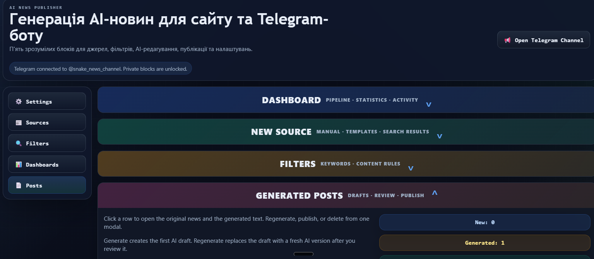
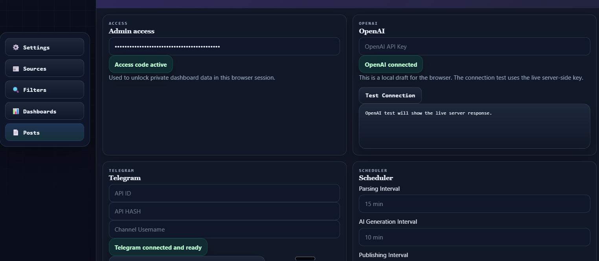
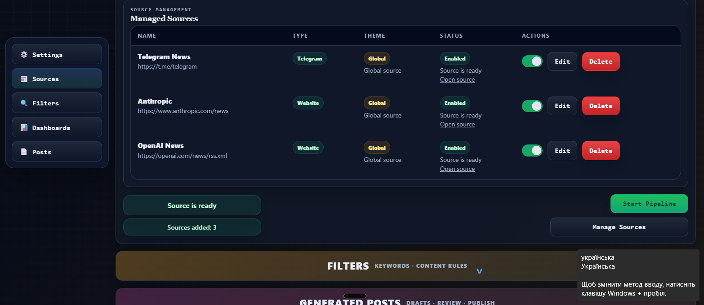
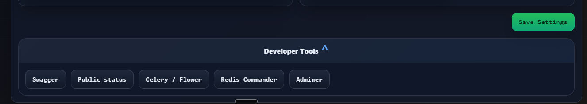

# AI News Pipeline

[](https://github.com/<your-github-username>/<your-repo-name>/actions/workflows/ci.yml)


I prepared this project as an educational service for automated AI news collection from RSS and Telegram, draft generation, manual review, and Telegram publishing. It is ready to be demonstrated both through the dashboard and through terminal/API flows, which is important for technical evaluation.

## Project Summary

- FastAPI backend with Swagger: `http://localhost:8000/docs`
- static dashboard with no separate frontend build step
- Celery pipeline for collection, filtering, generation, and publishing
- PostgreSQL for main data, Redis for queues
- RSS and Telegram source support
- OpenAI generation or a demo fallback
- manual control, logs, history, and status panels

## CI/CD

The repository now includes a GitHub Actions workflow: [`.github/workflows/ci.yml`](.github/workflows/ci.yml). It runs a basic CI check with dependency installation and `pytest -q` on push and pull request.

## Quick Start

```powershell
Copy-Item .env.example .env
docker compose build
docker compose up -d
docker compose ps
```

Links:

- Dashboard: `http://localhost:8000/`
- Swagger: `http://localhost:8000/docs`
- Health: `http://localhost:8000/api/health`
- Flower: `http://localhost:5555/`
- Redis Commander: `http://localhost:8081/`
- Adminer: `http://localhost:8082/`

## Minimal Configuration

Required in `.env`:

- `POSTGRES_PASSWORD`
- `ADMIN_API_KEY`

Optional:

- `OPENAI_API_KEY` for real AI generation
- `TELEGRAM_BOT_TOKEN` + `TELEGRAM_TARGET_CHANNEL` for publishing
- `TELEGRAM_API_ID` + `TELEGRAM_API_HASH` for Telegram source reading

## Terminal Workflow

```powershell
.\\.venv\\Scripts\\python.exe -m pytest -q
docker compose ps
docker compose logs --tail=80 app
docker compose logs --tail=80 celery
docker compose logs --tail=80 flower
Invoke-WebRequest http://localhost:8000/api/health
Invoke-WebRequest http://localhost:8000/api/public-status
```

Generate `ADMIN_API_KEY`:

```powershell
.\\.venv\\Scripts\\python.exe -c "import secrets; print(secrets.token_urlsafe(32))"
```

Quick log checks:

```powershell
docker compose logs --tail=120 app
docker compose logs --tail=120 celery
docker compose logs --tail=120 flower
```

Admin API checks:

```powershell
$headers = @{ 'X-API-Key' = 'PASTE_ADMIN_API_KEY_HERE' }
Invoke-RestMethod -Headers $headers http://localhost:8000/api/settings
Invoke-RestMethod -Headers $headers -Method Post http://localhost:8000/api/openai/check
Invoke-RestMethod -Headers $headers -Method Post http://localhost:8000/api/telegram/check
Invoke-RestMethod -Headers $headers -Method Post http://localhost:8000/api/pipeline/run
Invoke-RestMethod -Headers $headers http://localhost:8000/api/pipeline/status
Invoke-RestMethod -Headers $headers http://localhost:8000/api/logs/errors
Invoke-RestMethod -Headers $headers http://localhost:8000/api/posts
```

## Architecture

- `app/main.py` - FastAPI entrypoint and dashboard
- `app/api/` - endpoints, auth, response schemas
- `app/tasks.py` - Celery pipeline
- `app/news_parser/` - RSS and Telegram parsing
- `app/ai/` - OpenAI client and demo fallback
- `app/telegram/` - bot and publishing
- `app/services/` - business logic and source catalog
- `app/frontend/` - HTML/CSS/JS dashboard
- `tests/` - pytest scenarios

## What I polished for submission

- unified the dashboard styling
- synchronized Telegram templates between frontend and backend
- improved popup and status feedback
- removed the outdated stop pipeline flow from UI and docs
- kept terminal and API usage as first-class workflows
- added GitHub CI workflow
- rewrote the README set for submission

## Requirements Checklist

- [x] News collection from websites
- [x] News collection from public Telegram channels
- [x] Separate RSS and Telegram parsers
- [x] Async processing through Celery
- [x] Pipeline: parsing -> filtering -> generation -> publishing
- [x] AI post generation through API or demo fallback
- [x] OpenAI and Telegram error handling
- [x] Filtering by keywords, language, and source
- [x] Basic duplicate protection
- [x] Telegram publishing
- [x] API for source management
- [x] API for keywords and filters
- [x] API for post history and error logs
- [x] Swagger API documentation
- [x] Docker Compose demo setup
- [x] Terminal-based verification flow

## Screenshots

### Dashboard overview



### Settings



### Sources



### Developer tools



## Common Issues

- `401` - missing or invalid `ADMIN_API_KEY`
- Telegram parsing fails - check `TELEGRAM_API_ID`, `TELEGRAM_API_HASH`, and the Telethon session
- Telegram publishing fails - check the bot token, target channel, and bot admin rights
- OpenAI is unavailable - the project can still be demonstrated in demo mode

## Submission Ready

Before presenting the project, run:

```powershell
.\\.venv\\Scripts\\python.exe -m pytest -q
docker compose up -d
Invoke-WebRequest http://localhost:8000/api/health
```

For the final badge header, replace `<your-github-username>` and `<your-repo-name>` with the actual GitHub repository coordinates.
