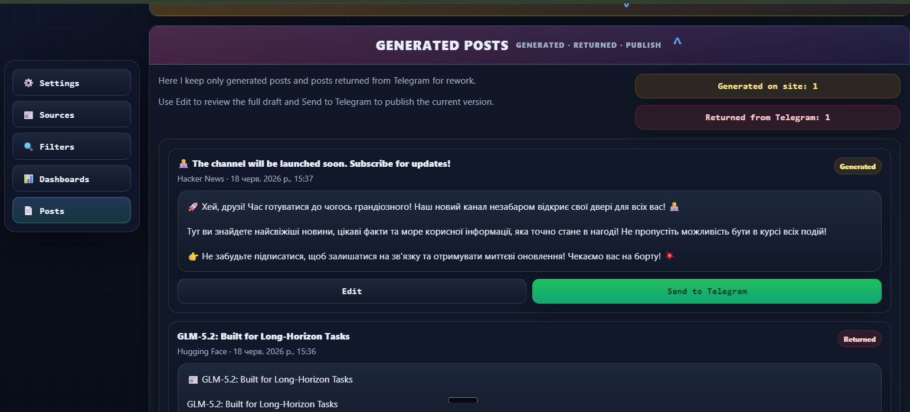

# AI News Pipeline

[](https://github.com/Marina4e/AINewsPipelineJavarush/actions/workflows/ci.yml)


Я підготувала цей проєкт як навчальний сервіс для автоматизованого збору AI-новин із RSS та Telegram, генерації постів, ручного рев'ю та публікації в Telegram-канал. Проєкт можна показувати і через dashboard, і через термінал або API, що важливо для технічної здачі.

## Що це за проєкт

- FastAPI backend із Swagger: `http://localhost:8000/docs`
- dashboard без окремого frontend build step
- Celery pipeline для збору, фільтрації, генерації та публікації
- PostgreSQL для основних даних, Redis для черг
- RSS та Telegram-джерела
- OpenAI або demo fallback для генерації постів
- ручний запуск, ручна перевірка, логи, історія, статуси

## CI/CD

Репозиторій: [git@github.com:Marina4e/AINewsPipelineJavarush.git](git@github.com:Marina4e/AINewsPipelineJavarush.git)

У репозиторій додано GitHub Actions workflow: [`.github/workflows/ci.yml`](.github/workflows/ci.yml). Він запускає базову CI-перевірку: встановлення залежностей та `pytest -q` для pull request і push.

## Швидкий старт

```powershell
Copy-Item .env.example .env
docker compose build
docker compose up -d
docker compose ps
docker compose down -v -вихід
```

Посилання:

- Dashboard: `http://localhost:8000/`
- Swagger: `http://localhost:8000/docs`
- Health: `http://localhost:8000/api/health`
- Flower: `http://localhost:5555/`
- Redis Commander: `http://localhost:8081/`
- Adminer: `http://localhost:8082/`

## Мінімальна конфігурація

Обов'язково заповнити у `.env`:

- `POSTGRES_PASSWORD`
- `ADMIN_API_KEY`

Опційно:

- `OPENAI_API_KEY` для реальної AI-генерації
- `TELEGRAM_BOT_TOKEN` + `TELEGRAM_TARGET_CHANNEL` для публікації
- `TELEGRAM_API_ID` + `TELEGRAM_API_HASH` для читання Telegram-джерел

## Робота через термінал

```powershell
.\\.venv\\Scripts\\python.exe -m pytest -q
docker compose ps
docker compose logs --tail=80 app
docker compose logs --tail=80 celery
docker compose logs --tail=80 flower
docker compose logs -f app
docker compose logs -f celery
docker compose logs -f flower
Invoke-WebRequest http://localhost:8000/api/health
Invoke-WebRequest http://localhost:8000/api/public-status
```

Створити `ADMIN_API_KEY`:

```powershell
.\\.venv\\Scripts\\python.exe -c "import secrets; print(secrets.token_urlsafe(32))"
```
```
$bytes = New-Object byte[] 32 
 [System.Security.Cryptography.RandomNumberGenerator]::Fill($bytes)
 [Convert]::ToBase64String($bytes)
```
Швидка перевірка логів:

```powershell
docker compose logs --tail=120 app
docker compose logs --tail=120 celery
docker compose logs --tail=120 flower
docker compose logs -f app celery
```



Коротко про те, як я це зрозуміла під час роботи з цим застосунком:

- `Celery` у цьому проєкті відповідає за важкі фонові задачі: збір новин, генерацію постів і публікацію, щоб dashboard не зависав.
- `Redis` тут працює як брокер черги: саме через нього FastAPI, Celery worker і pipeline обмінюються задачами та станами.
- `Celery Beat` потрібен для регулярного запуску сценаріїв без ручного кліку, тобто для автоматичного розкладу парсингу.
- `Flower` виявився дуже корисним для швидкої перевірки, чи задача реально стартувала, зависла, впала або завершилась успішно.

Що конкретно я винесла з цього проєкту:

- я навчилася відрізняти помилки UI від помилок воркера, брокера і зовнішніх інтеграцій;
- я побачила, що логи, черга задач і статуси в dashboard треба перевіряти разом, а не окремо;
- я краще зрозуміла, як будувати pipeline, де FastAPI лише запускає процес, а основна робота виконується асинхронно;
- я навчилася дебажити Telegram, Celery і фонова виконання не тільки через код, а й через runtime-логи.

Адмінські запити:

```powershell
$headers = @{ 'X-API-Key' = 'PASTE_ADMIN_API_KEY_HERE' }
Invoke-RestMethod -Headers $headers http://localhost:8000/api/settings
Invoke-RestMethod -Headers $headers -Method Post http://localhost:8000/api/openai/check
Invoke-RestMethod -Headers $headers -Method Post http://localhost:8000/api/telegram/check
Invoke-RestMethod -Headers $headers -Method Post http://localhost:8000/api/pipeline/run
Invoke-RestMethod -Headers $headers http://localhost:8000/api/pipeline/status
Invoke-RestMethod -Headers $headers http://localhost:8000/api/logs/errors
Invoke-RestMethod -Headers $headers http://localhost:8000/api/posts
```
## Testing:

.venv\Scripts\python.exe -m pytest -q -> 8/8

## Архітектура

- `app/main.py` - точка входу FastAPI та dashboard
- `app/api/` - endpoints, auth, response schemas
- `app/tasks.py` - Celery pipeline
- `app/news_parser/` - RSS та Telegram parsing
- `app/ai/` - OpenAI client і demo fallback
- `app/telegram/` - bot і publishing
- `app/services/` - бізнес-логіка та каталоги джерел
- `app/frontend/` - HTML/CSS/JS dashboard
- `tests/` - pytest сценарії

## Що я доробила для здачі

- спростила й уніфікувала dashboard-вигляд
- синхронізувала Telegram templates на фронтенді та бекенді
- додала зрозуміліші popup/status реакції
- прибрала застарілий stop pipeline сценарій з інтерфейсу та документації
- залишила запуск не лише через UI, а й через PowerShell/API
- додала CI workflow для GitHub
- оновила README під формат здачі

## Чек-ліст відповідності вимогам

- [x] Збір новин із сайтів
- [x] Збір новин із Telegram-каналів
- [x] Окремі парсери для RSS та Telegram
- [x] Асинхронна обробка через Celery
- [x] Pipeline: парсинг -> фільтрація -> генерація -> публікація
- [x] AI-генерація постів через API або demo fallback
- [x] Обробка помилок OpenAI/Telegram
- [x] Фільтрація за ключовими словами, мовою, джерелом
- [x] Базове виключення дублів
- [x] Публікація в Telegram
- [x] API для керування джерелами
- [x] API для ключових слів і фільтрів
- [x] API для історії постів і логів
- [x] Swagger документація
- [x] Docker Compose для демонстрації
- [x] Перевірка сценаріїв через термінал

## Скріншоти

### Dashboard overview


### Settings


### Sources


### Developer tools


## Типові проблеми

- `401` - неправильний або відсутній `ADMIN_API_KEY`
- Telegram parsing не працює - перевірити `TELEGRAM_API_ID`, `TELEGRAM_API_HASH` і Telethon session
- Telegram publishing не працює - перевірити bot token, target channel і права бота
- OpenAI недоступний - можна демонструвати проєкт у demo-режимі

## Готовність до здачі

Перед показом достатньо виконати:

```powershell
.\\.venv\\Scripts\\python.exe -m pytest -q
docker compose up -d
Invoke-WebRequest http://localhost:8000/api/health
```

GitHub workflow уже прив'язаний до репозиторію `Marina4e/AINewsPipelineJavarush`.
